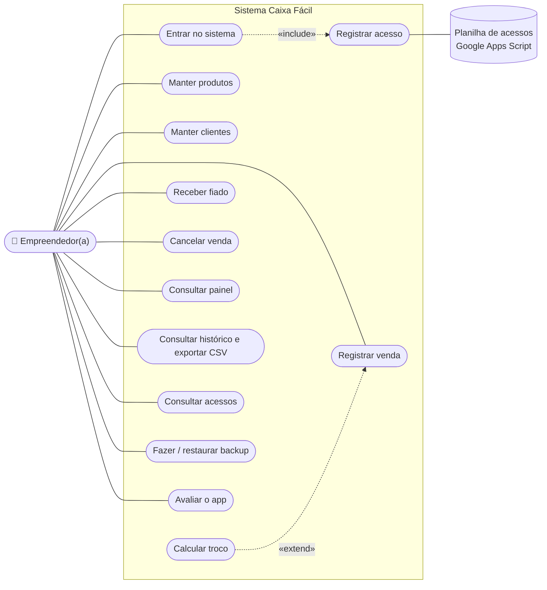
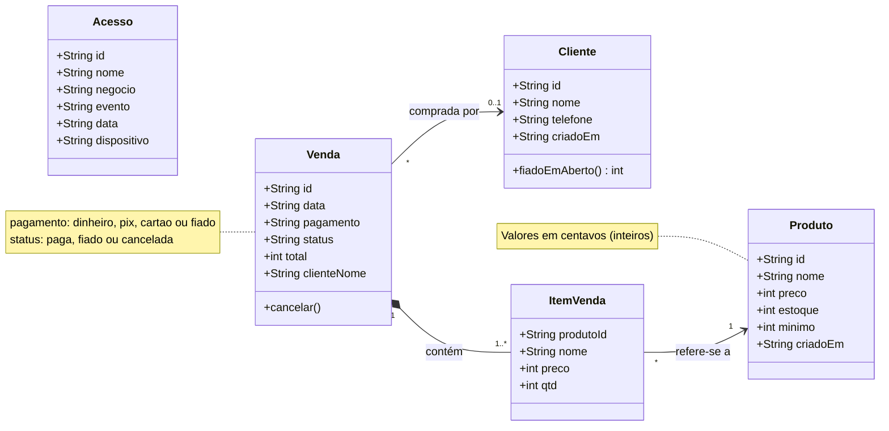
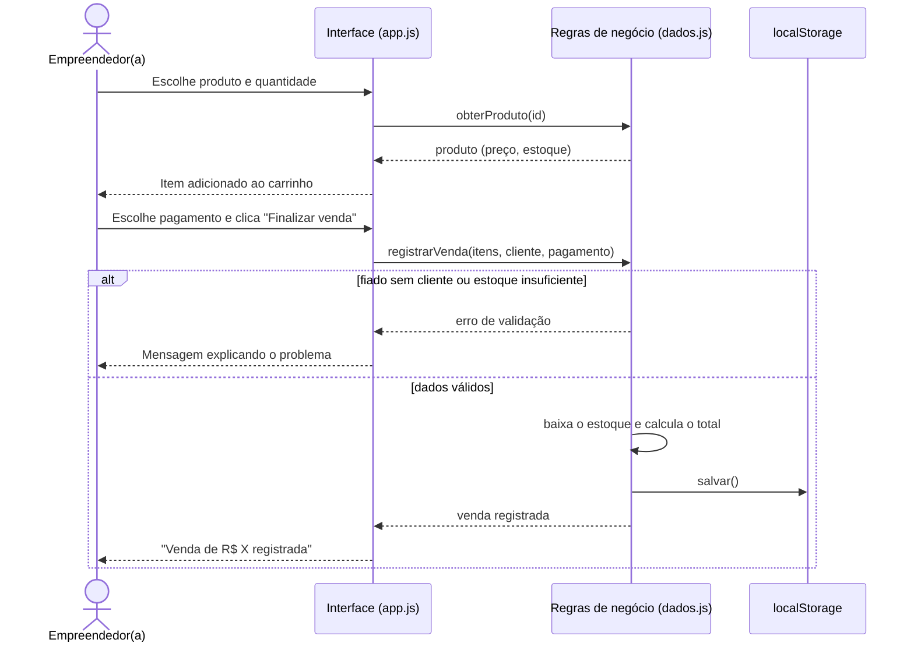
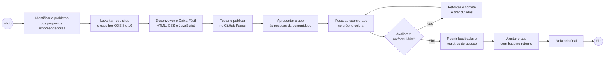

# Diagramas do Caixa Fácil

Os diagramas abaixo são escritos em [Mermaid](https://mermaid.js.org/), que o GitHub desenha automaticamente.

## 1. Diagrama de casos de uso (UML)

## 2. Diagrama de classes (UML)

## 3. Diagrama de sequência: registrar uma venda (UML)

## 4. Processo da atividade extensionista (BPMN simplificado)

